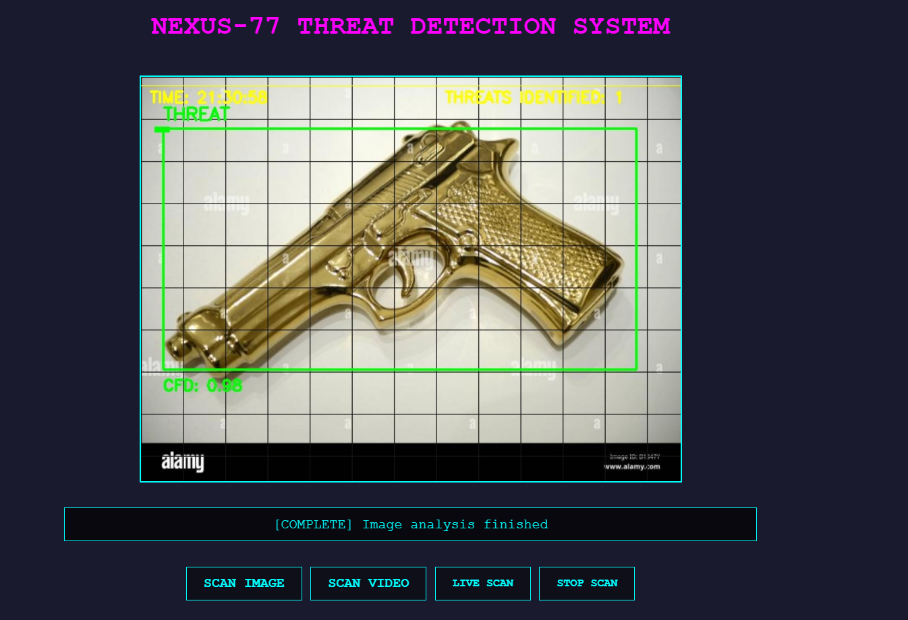
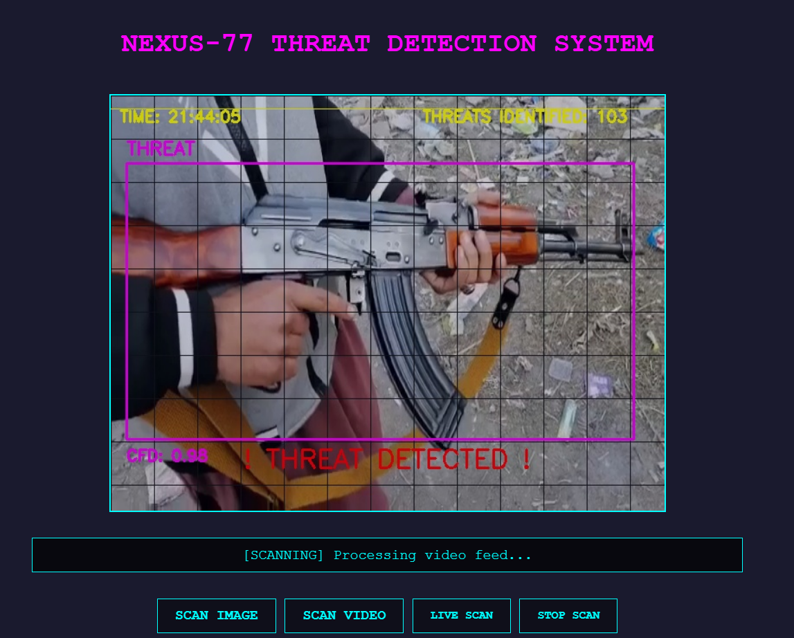
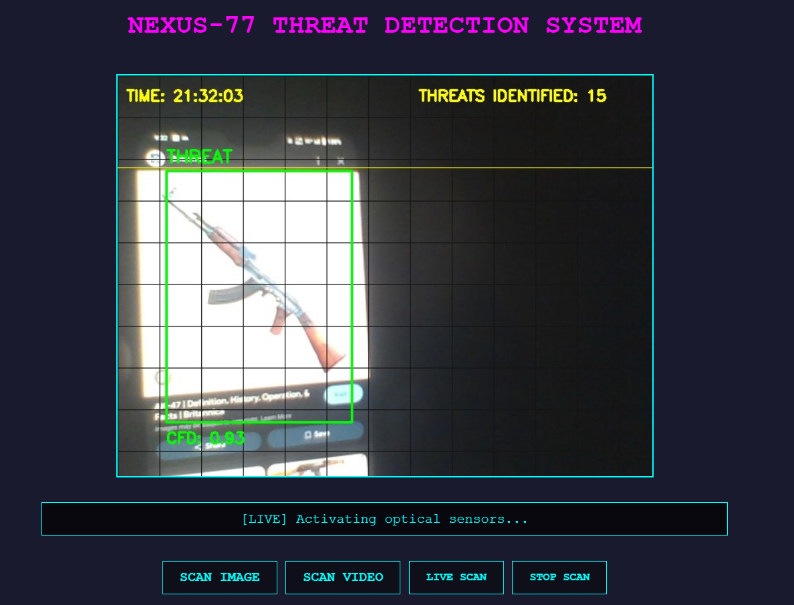

# Weapon Detection System

## 📌 Overview

The **Weapon Detection System** is an AI-powered security application designed to detect weapons in images, videos, and live video feeds. It utilizes **YOLOv3** for real-time object detection and features a Flask-based web interface for seamless user experience.

## 🚀 Features

- **📷 Image Upload Detection** - Detect weapons in uploaded images.
- **📹 Video Upload Detection** - Scan weapon presence in video files.
- **📡 Live Video Stream Detection** - Monitor and detect weapons in real-time via webcam or connected CCTV.
- **📊 Detection Logs & Reports** - Stores logs for later analysis.
- **🔒 Flask Web Interface** - Interactive web-based UI for ease of use.
- **📌 Multi-class Object Detection** - Detects guns, knives, and other dangerous weapons.
- **🎨 User-friendly Dashboard** - Displays real-time results.

---

## ⚙️ Installation

### Prerequisites

Ensure you have **Python 3.8+** and the following dependencies installed:

```sh
pip install opencv-python numpy flask flask-wtf werkzeug torch torchvision pillow
```

### Clone the Repository

```sh
git clone https://github.com/yourusername/weapon-detection-system.git
cd weapon-detection-system
```

### Download YOLOv3 Model Files

```sh
https://drive.google.com/drive/folders/1bZ8GqY2gOHRp9MFuOiU8ZklJjRQOJlhJ?usp=drive_link
```

Place these files in the **model/** directory:

```
weapon-detection-system/
│── model/
│   ├── yolov3.cfg
│   ├── yolov3.weights
│── app.py
│── run.py
│── templates/
│── static/
```

---

## ▶️ Usage

### Run the Flask Web Application

```sh
python run.py
```

The application will be available at:

```
http://127.0.0.1:5000/
```

### 📷 Image Detection

- Upload an image via the web interface.
- The system will detect and highlight any weapons.

### 📹 Video Detection

- Upload a video file.
- The system will process and detect weapons frame by frame.

### 📡 Live Webcam Detection

- Click **Live Video** in the web UI.
- The system will analyze the video feed in real time.

---

## 📜 Configuration

Modify **config.py** for customization:

```python
MODEL_CONFIG = "model/yolov3.cfg"
MODEL_WEIGHTS = "model/yolov3.weights"
MODEL_CLASSES = "model/coco.names"
CONFIDENCE_THRESHOLD = 0.5
NMS_THRESHOLD = 0.3
```
---

## 📷 Sample Output

***Using Image***


***Using Video***


***Using Cam feed***


---

## 📌 Contributing

Pull requests are welcome. For major changes, please open an issue first to discuss what you’d like to change.

```sh
git checkout -b feature-branch
git commit -m "Add new feature"
git push origin feature-branch
```


## 📄 License

MIT License © 2025 [Aikansh Karde](https://github.com/CarbezonKARDE)

